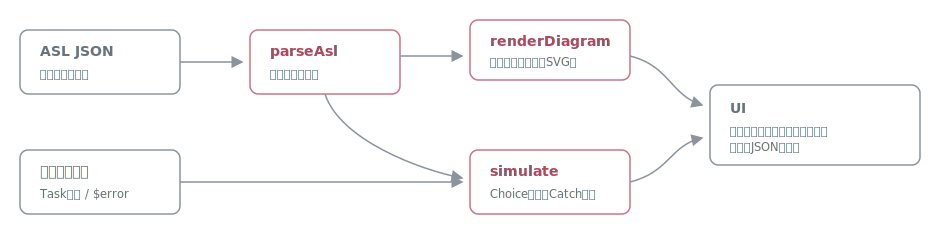

# sfnviz

[](https://github.com/miruky/sfnviz/actions/workflows/ci.yml)
[](https://www.typescriptlang.org/)
[](https://vitest.dev/)
[](https://opensource.org/licenses/MIT)

**Step Functionsのステートマシン定義(ASL)をSVG遷移図にして、モック実行でデータの流れをステップごとに追えるブラウザデバッガです。**

## 概要

ASL JSONを貼り付けると、状態遷移をその場で図にします。Choiceの分岐条件やCatchのエラー経路は辺のラベルと線種で読め、ParallelのブランチとMapのプロセッサは入れ子の枠として描かれます。さらに、実行入力とTaskのモック結果を与えて「実行」すると、実AWSを呼ばずにステートマシンを最後まで(あるいは失敗するまで)シミュレートし、各ステップの入力・出力・選ばれた分岐・キャッチされたエラーを図のハイライトと合わせて1ステップずつ確認できます。解析と実行はすべてブラウザ内で完結し、定義や入力が外部へ送信されることはありません。

試す: https://miruky.github.io/sfnviz/

### なぜ作ったのか

Step Functionsのデバッグは「デプロイして、実行して、コンソールで失敗した状態のログを開く」の繰り返しになりがちで、ResultPathの書き間違いひとつ確かめるにも時間がかかります。手元でデータの形がどう変わっていくかだけを素早く確かめたい、Choiceの条件が意図どおりに分岐するかをデプロイ前に見たい、という用途のための軽いシミュレータです。

## 使い方

- ASL JSONを左のエディタに貼り付けるか、サンプル(Choice + Catch、Parallel、Map + ループ)から選びます
- 「実行入力」に最初のJSONを、「Taskのモック結果」に状態名をキーにした結果を書きます。`{"$error": "名前"}` を与えるとそのTaskはエラーを投げ、Catchの動きを確かめられます
- 「実行する」でシミュレートし、「前へ / 次へ」(または左右キー)でステップを移動します。図では現在の状態が強調され、通過済みの状態は薄く塗られます

## アーキテクチャ



`parseAsl` がASLを検証して状態と遷移(Next・Choice・Default・Catch)を抽出し、`renderDiagram` がBFSの深さで行を決める再帰レイアウトでSVGを組み立てます(Parallel / Mapは子ステートマシンを入れ子に描画)。`simulate` はChoice規則の評価、InputPath / Parameters / ResultPath / OutputPathによるデータ加工、Catchによる回復を再現し、全ステップのトレースを返します。いずれもDOM非依存の純粋関数で、テストはこの層に集中しています。

## 技術スタック

| カテゴリ   | 技術                 |
| :--------- | :------------------- |
| 言語       | TypeScript 5(strict) |
| ビルド     | Vite                 |
| テスト     | Vitest(45テスト)     |
| リンタ     | ESLint + Prettier    |
| CI / CD    | GitHub Actions       |
| 配信       | GitHub Pages         |
| 実行時依存 | なし                 |

## 対応しているASL

- 状態: Task / Pass / Choice / Wait / Succeed / Fail / Parallel / Map
- Choice: String / Numeric / Boolean / Timestamp系の比較、StringMatches、Is系、And / Or / Not、〜Path演算子
- データ加工: InputPath・Parameters(ItemSelector)・ResultSelector・ResultPath・OutputPath、参照パスはドット記法と配列添字
- エラー処理: Catch(ErrorEquals / States.ALL / ResultPath)。モックの `$error` で任意のエラーを注入できる
- Map: ItemsPath と ItemProcessor(旧Iterator)。無限ループは300ステップで停止する

## プロジェクト構成

- `src/lib/jsonpath.ts` — ASL参照パスの取得・書き込み・テンプレート展開
- `src/lib/asl.ts` — ASLの解析・検証と遷移の抽出
- `src/lib/choice.ts` — Choice規則の評価
- `src/lib/runner.ts` — シミュレータとトレース生成
- `src/lib/diagram.ts` — 再帰レイアウトとSVG描画
- `src/lib/examples.ts` — サンプル定義
- `src/app.ts` — エディタ・図・ステップ再生の配線
- `docs/architecture.svg` — アーキテクチャ図

## はじめ方

### 前提条件

- Node.js 20 以上

### セットアップ

```bash
git clone https://github.com/miruky/sfnviz.git
cd sfnviz
npm install
npm run dev
```

### テストの実行

```bash
npm test
```

### Lintの実行

```bash
npm run lint
```

### デプロイ

`main` ブランチへのプッシュで GitHub Actions がビルドし、GitHub Pages へ配信します。

## 設計方針

- **実AWSを呼ばない** — Taskはモックで置き換え、データの形と遷移の確認に特化する
- **トレースを一級市民にする** — シミュレータは結果だけでなく全ステップの入出力と判断理由を返し、UIはそれを再生するだけ
- **入れ子をそのまま描く** — Parallel / Mapは別図に分けず、親の枠の中に子のフローを描いて全体を一望できるようにする

## 制約

Retry(再試行ポリシー)はシミュレーションでは評価しません(エラーは即Catchへ渡ります)。組み込み関数(States.Format など)、コンテキストオブジェクト(`$$`)、Map の分散モード、Timeout / Heartbeat は未対応です。Waitは実際には待ちません。実機の挙動の最終確認はAWS上で行ってください。

## ライセンス

[MIT](LICENSE)
